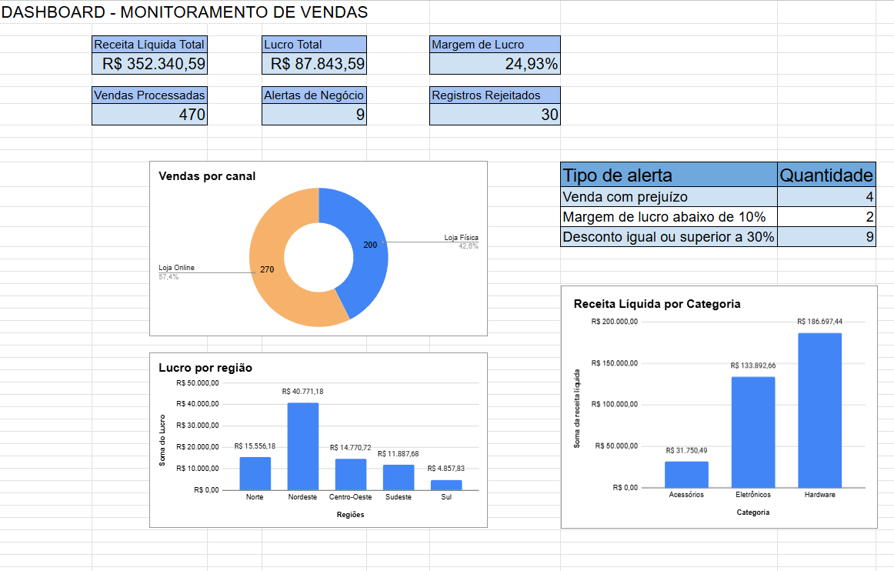
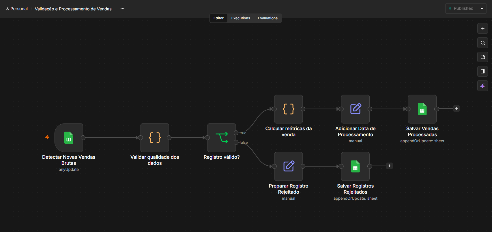
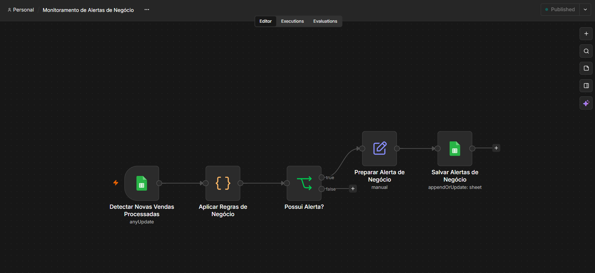
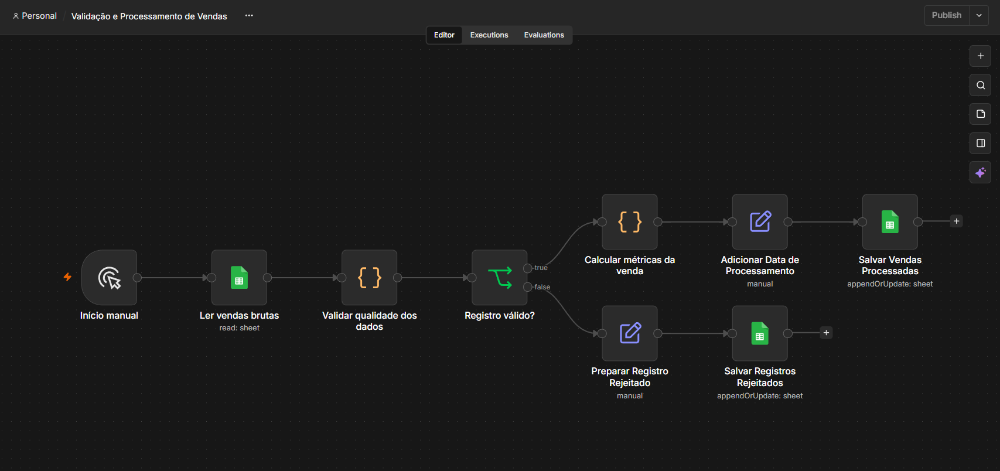
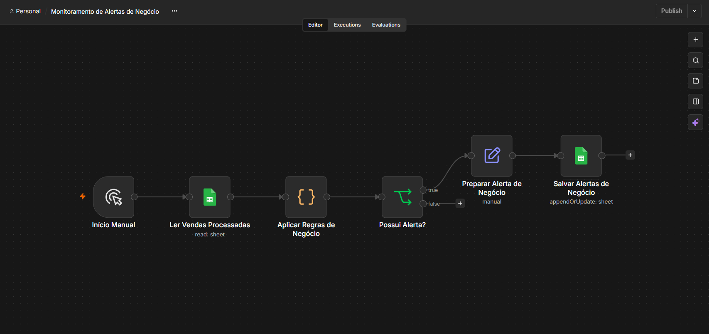

# Automação e Monitoramento de Vendas com n8n + Google Sheets

Pipeline de **automação e qualidade de dados** construído com **n8n**, **Google Sheets**, **Python** e **Docker**. Registros de vendas chegam continuamente, são **validados, processados e monitorados automaticamente** antes de irem para análise.

> Todos os dados são fictícios e foram criados apenas para estudo e demonstração.



### Resultados em resumo

| Indicador | Resultado |
|---|---:|
| Vendas brutas recebidas | 500 |
| Vendas válidas processadas | 470 |
| Registros rejeitados | 30 |
| Receita Líquida Total | R$ 352.340,59 |
| Lucro Total | R$ 87.843,59 |
| Margem de Lucro | 24,93% |
| Alertas de Negócio | 9 |

Auditoria do fluxo: `500 = 470 + 30`

---

## Sumário

- [Problema de negócio](#problema-de-negócio)
- [Arquitetura](#arquitetura)
- [Estrutura do Google Sheets](#estrutura-do-google-sheets)
- [Dados brutos](#dados-brutos)
- [Regras de validação](#regras-de-validação)
- [Processamento das vendas válidas](#processamento-das-vendas-válidas)
- [Regras de negócio e alertas](#regras-de-negócio-e-alertas)
- [Automação](#automação)
- [Ambiente de execução](#ambiente-de-execução)
- [Resultados detalhados](#resultados-detalhados)
- [Workflows](#workflows)
- [Limitações e próximos passos](#limitações-e-próximos-passos)
- [Estrutura do repositório](#estrutura-do-repositório)
- [Tecnologias](#tecnologias)
- [Uso de Inteligência Artificial](#uso-de-inteligência-artificial)
- [Contato](#contato)

---

## Problema de negócio

Em um cenário real, os dados de vendas vêm de um ERP, CRM, e-commerce ou outro sistema. Aqui, o **Google Sheets representa essa camada operacional de entrada**.

O objetivo foi automatizar tarefas que normalmente exigiriam trabalho manual:

- identificar registros incompletos ou inconsistentes;
- separar dados inválidos;
- calcular métricas financeiras;
- identificar vendas com prejuízo ou baixa margem;
- monitorar descontos elevados;
- manter uma base processada pronta para análise;
- atualizar indicadores e visualizações automaticamente.

---

## Arquitetura

A solução é dividida em dois workflows no n8n.

### Workflow 1 — Validação e Processamento de Vendas

Valida os registros recebidos e processa somente as vendas consideradas confiáveis.

```text
Google Sheets Trigger
vendas_brutas
        ↓
Validar qualidade dos dados
        ↓
Registro válido?
     ↙         ↘
   Não         Sim
    ↓           ↓
Preparar      Calcular métricas
registro      da venda
rejeitado       ↓
    ↓         Adicionar
Salvar em     processado_em
registros_       ↓
rejeitados    Salvar/atualizar
              vendas_processadas
```

### Workflow 2 — Monitoramento de Alertas de Negócio

Analisa as vendas já processadas e identifica situações comerciais que exigem atenção.

```text
Google Sheets Trigger
vendas_processadas
        ↓
Aplicar regras de negócio
        ↓
Possui alerta?
     ↙       ↘
   Não       Sim
              ↓
        Preparar alerta
              ↓
        Salvar/atualizar
        alertas_negocio
```

---

## Estrutura do Google Sheets

Um único arquivo do Google Sheets, organizado em abas:

| Aba | Função |
|---|---|
| `vendas_brutas` | Dados de entrada |
| `vendas_processadas` | Dados validados e enriquecidos |
| `registros_rejeitados` | Erros de qualidade |
| `alertas_negocio` | Alertas comerciais |
| `dashboard` | Indicadores consolidados |

## Arquivo final do projeto

O projeto foi desenvolvido integralmente no **Google Sheets**, utilizado como camada de entrada, armazenamento e visualização dos dados.

Para facilitar o acesso ao resultado final pelo GitHub, a planilha foi exportada em formato `.xlsx` e incluída neste repositório:

[`Projeto_Automacao_Vendas.xlsx`](Projeto_Automacao_Vendas.xlsx)

O arquivo `.xlsx` representa uma cópia estática da versão final da planilha.  
Toda a construção, automação, fórmulas, organização das abas e dashboard foram realizados originalmente no Google Sheets.

### Visualização no Google Sheets

A versão utilizada durante o desenvolvimento também pode ser visualizada diretamente no Google Sheets:

[Visualizar planilha no Google Sheets](https://docs.google.com/spreadsheets/d/1mj1srdwK2_r-awKHMFtbyC9RC7KIq_3BbnIhkLCfsKU/edit?usp=sharing)

---

## Dados brutos

A base inicial tem **500 registros fictícios de vendas** em um cenário brasileiro, com problemas de qualidade inseridos propositalmente para testar a validação.

Campos da camada de entrada:

`id_pedido`, `data_venda`, `id_cliente`, `id_produto`, `nome_produto`, `categoria`, `regiao`, `estado`, `quantidade`, `preco_unitario`, `custo_unitario`, `desconto_pct`, `canal_venda`, `criado_em`

---

## Regras de validação

A validação roda em **Python** dentro do n8n. Cada registro é analisado individualmente e pode acumular mais de um erro antes de ser classificado como válido ou inválido.

**Completude:** os 14 campos são obrigatórios.

**Tipos e formatos:** `quantidade`, `preco_unitario`, `custo_unitario` e `desconto_pct` devem ser numéricos.

**Intervalos permitidos:**

```text
quantidade > 0
preco_unitario > 0
custo_unitario >= 0
0 <= desconto_pct <= 1
```

**Canal de venda:** apenas `Loja Física` e `Loja Online`.

**Consistência geográfica:** o estado deve corresponder à região correta.

```text
SP → Sudeste    PR → Sul    BA → Nordeste
MS → Centro-Oeste    AM → Norte
```

**Consistência do catálogo:** 3 categorias (Hardware, Eletrônicos, Acessórios), cada uma com 5 produtos. O pipeline verifica a coerência entre:

```text
id_produto ↔ nome_produto ↔ categoria
```

---

## Processamento das vendas válidas

Somente registros aprovados seguem para o cálculo:

```text
receita_bruta   = quantidade × preco_unitario
valor_desconto  = receita_bruta × desconto_pct
receita_liquida = receita_bruta - valor_desconto
custo_total     = quantidade × custo_unitario
lucro           = receita_liquida - custo_total
margem_pct      = lucro / receita_liquida
```

O campo `processado_em` registra o momento do processamento.

---

## Regras de negócio e alertas

O segundo workflow aplica três regras:

| Alerta | Condição |
|---|---|
| Venda com prejuízo | `lucro < 0` |
| Margem de lucro baixa | `0 <= margem_pct < 0.10` |
| Desconto elevado | `desconto_pct >= 0.30` |

Uma mesma venda pode gerar mais de um alerta.

---

## Automação

Durante o desenvolvimento, os workflows usaram **Manual Trigger** para facilitar testes e depuração. Depois que a lógica se estabilizou, foram trocados por **Google Sheets Trigger**:

- **Workflow 1** monitora `vendas_brutas`: linha adicionada ou atualizada é validada e processada automaticamente.
- **Workflow 2** monitora `vendas_processadas`: venda adicionada ou atualizada tem as regras de negócio verificadas.

Os nodes de gravação usam **Append or Update Row** com `id_pedido` como chave, evitando duplicação em reexecuções.


## Ambiente de execução

O n8n foi executado localmente em ambiente self-hosted utilizando Docker.

A solução foi organizada com:

- um container principal para o n8n;
- um container de task runner para execução dos Code Nodes em Python;
- volume persistente para preservar workflows, credenciais e configurações.

Essa estrutura permitiu utilizar Python dentro dos workflows mantendo o ambiente isolado e reproduzível.

### Integração com Google Sheets

A integração entre o n8n e o Google Sheets foi configurada através da Google Sheets API.

Para autenticação, foi criado um projeto no Google Cloud e configurado um cliente OAuth 2.0, permitindo que a instância local do n8n acessasse as planilhas utilizadas no projeto.

As credenciais OAuth não fazem parte deste repositório e são mantidas localmente por segurança.

---

## Resultados detalhados

### Auditoria

```text
500 vendas brutas = 470 válidas + 30 rejeitadas
```

### Motivos de rejeição

Cada um dos 30 registros rejeitados apresentou um único motivo de erro.

| Motivo | Quantidade |
|---|---:|
| Campo obrigatório vazio: `quantidade` | 6 |
| Campo obrigatório vazio: `custo_unitario` | 6 |
| Campo obrigatório vazio: `regiao` | 6 |
| Desconto fora do intervalo (0 a 1) | 6 |
| Estado incompatível com a região | 6 |
| **Total** | **30** |

As regras de canal de venda e de consistência do catálogo (`id_produto` ↔ `nome_produto` ↔ `categoria`) também fazem parte da validação, mas nenhum registro da base inicial as violou.


### Alertas de negócio

O monitoramento identificou **9 vendas com alerta**. Como uma mesma venda pode violar mais de uma regra, essas 9 vendas geraram **15 alertas** no total.

| Tipo de alerta | Alertas gerados |
|---|---:|
| Desconto elevado | 9 |
| Venda com prejuízo | 4 |
| Margem de lucro baixa | 2 |
| **Total de alertas** | **15** |

Combinações encontradas:

| Combinação | Vendas |
|---|---:|
| Venda com prejuízo + Desconto elevado | 4 |
| Margem de lucro baixa + Desconto elevado | 2 |
| Somente Desconto elevado | 3 |
| **Total de vendas com alerta** | **9** |

> Os alertas de prejuízo e de margem baixa nunca ocorrem juntos, pois as regras são mutuamente exclusivas (`lucro < 0` contra `0 <= margem_pct < 0.10`).

### Dashboard

KPIs: Receita Líquida Total, Lucro Total, Margem de Lucro, Vendas Processadas, Alertas de Negócio e Registros Rejeitados.

Gráficos: Receita Líquida por Categoria, Lucro por Região, Vendas por Canal e Quantidade de Alertas por Tipo.

Fórmulas, tabelas e gráficos leem as abas atualizadas pelo n8n, então o dashboard acompanha novas vendas automaticamente.

---

## Workflows

### 01 — Validação e Processamento de Vendas



Arquivo: `workflows_n8n/Validação e Processamento de Vendas.json`

### 02 — Monitoramento de Alertas de Negócio



Arquivo: `workflows_n8n/Monitoramento de Alertas de Negócio.json`

### Evolução: manual → automatizado

Os fluxos nasceram com gatilho manual para testes controlados e foram automatizados após a validação da lógica.

| Workflow | Versão inicial (manual) | Versão final (automática) |
|---|---|---|
| Validação |  |  |
| Monitoramento |  |  |

---


## Estrutura do repositório

```text
automacao-monitoramento-vendas/
│
├── README.md
├── Projeto_Automacao_Vendas.xlsx # exportação final da planilha do Google Sheets
├── .gitignore
│
├── tabela_original/
│   └── vendas_brutas.csv
│
├── workflows_n8n/
│   ├── Validação e Processamento de Vendas.json
│   └── Monitoramento de Alertas de Negócio.json
│
└── imagens/
    ├── dashboard.png
    ├── workflow_validação_inicial.png
    ├── workflow_validação_final.png
    ├── workflow_monitoramento_inicial.png
    └── workflow_monitoramento_final.png
```

---


## Tecnologias

- n8n
- Google Sheets (e Google Sheets API com OAuth via Google Cloud)
- Python
- Docker
- GitHub

## Uso de Inteligência Artificial

Ferramentas de IA generativa foram utilizadas como apoio durante o desenvolvimento do projeto, principalmente para:

- discutir decisões de arquitetura;
- revisar regras de validação e negócio;
- auxiliar na resolução de problemas de configuração;
- apoiar a documentação.

A configuração dos workflows, integrações, testes e validação dos resultados foi realizada durante o desenvolvimento do projeto.

A IA não faz parte da execução do pipeline: as validações e regras de negócio são realizadas por lógica determinística em Python e pelo próprio n8n.

---

## Objetivo do projeto

Praticar e demonstrar conhecimentos em automação de processos, integração entre ferramentas, qualidade de dados, validação de registros, processamento com Python, regras de negócio, monitoramento automatizado, organização de pipelines e construção de indicadores no Google Sheets.

---

## Contato


- LinkedIn: [Pietra Viegas](https://www.linkedin.com/in/pietra-viegas-581544309)
- GitHub: [Pietra Viegas](https://github.com/PietraViegas)
- E-mail: eipiviegas@gmail.com

